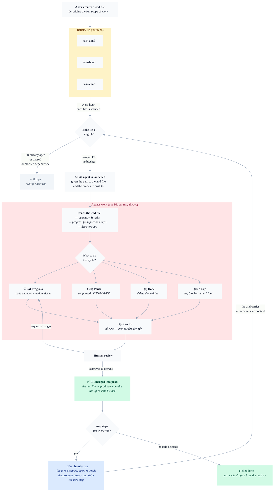

# Rondo

> **Long-running Epics, shipped one PR at a time, automatically.**

You write an Epic in a `.md` file in your repo — *"migrate the `orders` table, then update the backend API, then refactor the frontend to use it"*. Three steps. You commit the file and walk away.

Every hour, Rondo dispatches a background AI agent (Cursor, Claude Code, Codex…)[^further-reading] that reads the Epic, picks up where the last PR left off, and ships **one PR for the next step**. You review and merge. Next hour, the agent resumes from your merge and ships the step after. **No relaunching. No re-prompting. No standup.**

One Epic becomes a series of small, reviewable PRs. The Epic file itself accumulates decisions and progress history across all of them, so the next agent — even a week later, even a different model — picks up cleanly.

**Everything lives in your repo** — the queue, the mission, the decisions, the progress history. Not in a SaaS, not in a DB. The only thing Rondo persists outside is a single GitHub Issue whose body carries a `slug → branchName` lookup, overwritten every cycle ([why](#why-one-github-issue)).

We've been running this for **6 months** on a 3.2M-line monorepo. **1,500+ PRs** auto-started. Open-sourcing the method now.

## How it works

## What the agent gets every cycle

Each dispatch hands the agent three inputs (ticket path, target branch, base branch) plus the prompt below. Full text: [PROMPT.md](PROMPT.md).

> **You are an AI coding agent running one cycle of a Rondo ticket.** Read `TICKET_FILE` in full — frontmatter, mission, steps, decisions log, progress history.
>
> **Hard invariants:**
> - You **MUST** open exactly one PR per cycle. Not zero, not two.
> - You **MUST** modify the ticket `.md` file in the PR — even when you make no code changes.
> - The PR head branch **MUST** be `<BRANCH_NAME>`; the base **MUST** be `<BASE_BRANCH>`.
>
> **Then choose exactly one of four outputs:**
>
> - **(a) Progress** — ship the next step. Append to `Progress history` and any non-obvious calls to `Decisions`. Commit code + ticket edit.
> - **(b) Pause** — defer. Set `paused: YYYY-MM-DD` (or `paused: true`) in the frontmatter. No code change.
> - **(c) Done** — retire. Promote durable knowledge into canonical docs, then delete the `.md` file. On the next cycle the runner drops the ticket from the registry.
> - **(d) No-op** — document a blocker in `Decisions`. No code change. Still open a PR. Use sparingly — two (d) cycles in a row should become a (b).

Short by design. Rondo agents are smart; more rules hurt more than they help. Override per-repo by dropping a `rondo.prompt.md` file at your repo root — the runner picks it up automatically, no config needed (see [install/02-prompt.md](install/02-prompt.md)).

## Features

- **A ticket is one `.md` file, committed.** Your queue is in your repo, versioned, reviewable, greppable. No external PM tool.
- **Many PRs per ticket, orchestrated automatically.** Each step of a ticket is one small, reviewable PR. Once you merge, the next cycle picks up and ships the next step — no re-prompting, no manual relaunch. The ticket file accumulates the decisions log and progress history across all of them.
- **Tickets can depend on other tickets.** `depends: ticket-a, ticket-b` in the frontmatter makes the queue a DAG — nothing dispatches until its blockers are done (i.e. their `.md` files are deleted).
- **Tickets can be paused.** `paused: true` (indefinite) or `paused: 2026-05-01` (until a specific date). The runner skips paused tickets without side effects; the date is inclusive-start.
- **Per-ticket model choice.** `model: default` or a backend-specific alias (`claude-sonnet-4-6`, `cursor-fast`, etc.). Heavy work gets heavy models; cleanup work gets cheap ones.
- **Per-ticket priority.** `priority: 0–99`. Lower numbers dispatch first. Tie-break by filename.
- **One PR per run, always.** Even when the agent decides there's nothing to do, it opens a PR documenting why. No silent runs.
- **Open-PR guard.** If a PR is already open for a ticket, the runner skips — no duplicate agents, no race.
- **One Issue, not one per ticket.** A single registry Issue carries the `slug → branchName` lookup. Rewritten every cycle. No state machine, no labels to keep in sync, no webhook to wire.
- **Agent-agnostic.** Default backend is Cursor Background Agents. Swap in Claude Code remote, Codex Cloud, or your own HTTP endpoint — the contract is a 3-field dispatch call.
- **Self-resuming across days, weeks, or model changes.** Each ticket carries its own decisions log and progress history. The next cycle picks up where the last left off, even if the last cycle was weeks ago or used a different model.
- **Zero SaaS, MIT.** One reusable GitHub Action. No pricing page. Fork it, ship it, resell it — no gotcha.

## Install

Ask your coding agent:

> Read [INSTALL.md](INSTALL.md) and install Rondo in this repo.

The agent will walk you through the bricks (tickets folder, registry, scheduler, agent runner, prompt, optional extras), asking questions when choices need your input. There is no separate config file — every runtime knob is an input in the workflow file the scheduler brick creates.

See [INSTALL.md](INSTALL.md) for the modular menu, [SPEC.md](SPEC.md) for the normative spec, and [PROMPT.md](PROMPT.md) for the default agent prompt.

## Why it works

- **Tickets are committed** — the queue is in your repo, versioned, reviewable, mergeable
- **The ticket file is the memory** — decisions log + progress history accumulate across every PR, so the next cycle (hours or weeks later) picks up with full context
- **State is derived, not tracked** — every cycle, Rondo recomputes each ticket's status from the filesystem + the repo's open PRs. No state machine to get out of sync, no webhook to wire
- **Visibility is built-in** — the registry Issue is a live dashboard your team already watches in the Issues tab
- **One PR per cycle** — small, reviewable diffs; the human stays in the loop without standup

## Why one GitHub Issue

In principle, everything Rondo needs could live in the `.md` files themselves — the queue, the history, the decisions. In practice, Rondo needs one question answered every cycle: **"which branch is the current dispatch for ticket X working on?"**

If every agent backend let you choose the branch at launch, no external state would be needed — the runner could derive `rondo/<slug>` by convention and check for an open PR on that branch directly. But some backends don't: [Cursor's Background Agents API auto-generates the branch](https://forum.cursor.com/t/issue-with-autobranch-parameter-and-autocreatepr-functionality/152294/10), and the mapping isn't knowable until the dispatch returns. So Rondo persists the `slug → branchName` mapping.

That mapping lives in the body of **one** long-lived GitHub Issue — the *registry Issue* — identified by the label `rondo-registry`. The runner rewrites the body every cycle with current reality:

- A machine-readable JSON block `<!-- rondo-registry {...} -->`
- A human-readable table of all tickets, their current branch, and a derived state

No per-ticket Issues, no status labels, no state machine. The ticket files and the repo's open PRs are the sources of truth; the registry is just a lookup table.

A nice side-effect: **visibility for free**. Teams already watch the Issues tab — no dashboard to host, no new UI to learn.

If your backend lets you choose the branch at launch (so `rondo/<slug>` is always correct), the registry becomes cosmetic — the mapping is always derivable. Rondo still maintains it because the human-readable table is useful, but the runner would work without it.

## The spec, abridged

Rondo maintains **one long-lived GitHub Issue** per host repo:

- **Title:** `[Rondo] Ticket registry`
- **Label:** `rondo-registry` (how the runner finds it)
- **Body:** a `<!-- rondo-registry {...} -->` JSON block with `slug → branchName` + a human-readable table, rewritten at the end of every cycle

No per-ticket Issues. No status labels. No `Refs #` required in agent PRs. A ticket's state (eligible / in flight / paused / blocked / gone) is derived every cycle from the filesystem and the list of open PRs — nothing is persisted to transition.

Full normative spec: [SPEC.md](SPEC.md).

## Where this is going — three principles we're betting on

Rondo isn't just a task dispatcher. It's a bet on where agent-assisted software development is headed. We'll keep shipping this repo along these three lines.

1. **Tickets live in the code.** Not in a SaaS, not in a synced mirror — in `.md` files committed to your repo. The queue is git. If Rondo disappears tomorrow, your tickets are still yours, versioned with your code. The broader bet: specs, prompts, and agent tracking all belong alongside the code they drive, not in a parallel system that drifts.

2. **A ticket is not a PR.** The "one ticket = one PR" model forces you to choose between giant PRs (unreviewable) and splitting tickets artificially (bureaucracy). Rondo decouples them: one ticket file is a stream of PRs, orchestrated automatically across cycles. The `.md` file is the persistent unit that carries decisions and progress across PRs; each PR is disposable, small, and mergeable on its own. You never re-prompt — the next cycle reads where the last one left off.

3. **A PR is not one review.** Every non-trivial change actually needs three: a **domain review** (does this match the product intent?), an **engineering review** (is the design sound, does it fit the codebase?), and a **quality review** (does it work in a realistic environment?). These are three questions, best answered by three different people at three different times — often across different PRs on the same ticket. Rondo doesn't force them to collapse into one moment; the ticket file is where they converge over time.

## License

[MIT](LICENSE). Use it, fork it, ship it, resell it. No managed service planned — this is pure open source.

[^further-reading]: For readers who want to zoom out: Rondo sits in the **"scheduled agents / agent fleets"** space ([background-agents.com](https://background-agents.com/)) and is a building block toward what OpenAI calls [**harness engineering**](https://openai.com/index/harness-engineering/).
