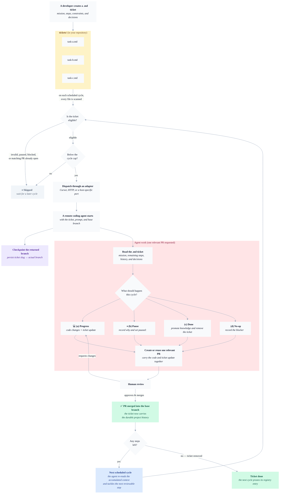

# Rondo

> A Git-native protocol and reference runner for turning long-lived work into small, reviewable pull requests.

Rondo keeps an Epic as a Markdown file in the repository. On each scheduled cycle, a runner derives which tickets are eligible and asks background coding agents to advance a bounded set. Each ticket carries its mission, decisions, and progress across agents and across time.

The repository ships two things:

- a small protocol: ticket format, eligibility, dispatch semantics, and branch mapping;
- a reference GitHub implementation: a Node 24 Action, a GitHub Issue registry, and Cursor/HTTP dispatch adapters.

It is a foundation to adapt, not a hosted control plane. GitHub, the scheduler, the registry transport, and the agent provider are ports around a deliberately small core.

> **Delivery semantics:** Rondo is **at least once**. It reduces duplicate work by checking open PR branches and by sending an idempotency key, but it cannot prove that a remote agent is still starting or that exactly one relevant PR exists. On retry, the prompt tells the agent to reuse a matching open PR instead of opening a second. These rules are instructions, not post-dispatch enforcement by the reference runner.

## The loop



One ticket can therefore produce many PRs. A normal cycle asks the agent to choose one outcome:

1. **Progress** — implement the next reviewable step and update the ticket.
2. **Pause** — record why work should wait and set `paused:`.
3. **Done** — promote durable knowledge and remove or archive the ticket.
4. **No-op** — document a blocker when neither progress nor pause fits.

See [PROMPT.md](PROMPT.md) for the exact agent contract.

## What is fixed, and what is a port

| Layer | Rondo invariant | Reference implementation | Replaceable? |
|---|---|---|---|
| Ticket | Markdown file plus line-based frontmatter | `tickets/<slug>.md` | Directory and authoring UX are configurable |
| Eligibility | Derived from files, pause/dependencies, accepted models, and open PR branches | Pure Node module | Yes, if semantics remain compatible |
| Scheduler | Repeated, serialized scans | GitHub Actions cron/manual run | Yes |
| Dispatch | One request per selected ticket, bounded per cycle | Cursor API or generic HTTP | Yes, through the adapter contract |
| VCS | Read open changes and maintain the branch registry | GitHub REST + one labelled Issue | Yes, through the VCS contract |
| Agent behavior | Request one relevant PR that updates the ticket and is reused on retry | Bundled prompt | Yes, but weakening it weakens interoperability |

The boundaries and porting guide live in [ADAPT.md](ADAPT.md). Adapter and VCS implementations have their own contracts in [action/src/adapters/CONTRACT.md](action/src/adapters/CONTRACT.md) and [action/src/vcs/CONTRACT.md](action/src/vcs/CONTRACT.md).

## Ticket example

Rondo frontmatter is intentionally not YAML: it is parsed one `key: value` line at a time until the first blank line.

```markdown
owner: alice
priority: 2
model: default
depends: migrate-orders

# Update order creation

## Mission
Move order creation to the new schema without changing the public API.

## Steps (1 PR each)

### Step 1 — Add the compatibility write path
### Step 2 — Move readers to the new columns
### Step 3 — Remove the compatibility path

## Decisions (newest first)

## Progress history (newest first)
```

Required keys are `owner`, `priority`, and `model`. Optional keys include `depends` and `paused`. Full normative rules are in [SPEC.md](SPEC.md); CI validation is described in [install/06-validate-tickets.md](install/06-validate-tickets.md).

## Reference implementation

The shipped Action currently supports:

- **`cursor-api`** — direct dispatch to Cursor Background Agents;
- **`http`** — POST to a receiver you operate, using the portable adapter contract.

Dedicated Claude Code and Codex Cloud adapters are **not shipped**. They can be reached through an HTTP receiver or implemented as new adapters. “Portable” means the boundaries are documented; it does not mean every provider works without integration code.

The reference runner also provides:

- priority ordering and `max-dispatches-per-cycle` (default `10`);
- an accepted-model allowlist;
- request timeouts (`request-timeout-seconds`, default `120`);
- HTTP URL validation, with cleartext HTTP disabled unless `http-allow-insecure: true`;
- a deterministic dispatch idempotency key;
- dry-run discovery without dispatch credentials;
- one GitHub registry Issue containing `slug → branchName`.

The idempotency key is a cooperation mechanism, not an exactly-once guarantee: a backend must honor it for duplicate requests to collapse.

## Install

### Prerequisites

- a GitHub repository and permission to add workflows;
- GitHub Actions enabled;
- `gh` authenticated for the repository if following the guided install;
- Node 24 only for local development—the Action supplies its own runtime;
- for Cursor: a `CURSOR_API_KEY` and the Cursor GitHub App installed on the target repository;
- for HTTP: an HTTPS receiver that implements the adapter contract.

The install is intentionally reviewable. It should go through the host repository's normal branch/PR policy. Do not try to dispatch the new workflow before its workflow file exists on GitHub.

Ask a coding agent:

> Read `INSTALL.md` from the reviewed Rondo source at `<RONDO_REF>` and install the recommended reference profile in this repository. Preserve existing files, use a branch or PR if required, and stop before setting secrets.

`<RONDO_REF>` must be an immutable reviewed commit SHA. A release tag may help humans discover a version, but production workflow examples deliberately do not rely on a movable tag or on `main`.

The practical sequence is:

1. discover the repository policy and existing Rondo footprint;
2. create the ticket, workflow, and optional validation files;
3. review and push them through the repository's normal merge path;
4. set the chosen backend secret;
5. run `workflow_dispatch` with `dry_run: true`;
6. run one controlled real dispatch.

Detailed, preservation-aware instructions are in [INSTALL.md](INSTALL.md).

## Cost, data, and operational expectations

- Every selected ticket can start a paid remote-agent run. Keep the default cycle cap, start with manual dispatch, and monitor provider usage before increasing cadence or capacity.
- The selected agent provider receives the repository identity, ticket path, branch/base names, model, and prompt; it generally clones the repository under its own authorization.
- The generic HTTP adapter sends that metadata and prompt to the configured receiver. HTTPS is required by default.
- GitHub Actions logs include ticket slugs, agent identifiers, branches, and errors. Do not put secrets in ticket text or prompt overrides.
- A dispatch may complete remotely after the workflow times out. Inspect open PRs and provider state before manually retrying.

See [SECURITY.md](SECURITY.md) for the trust model and deployment checklist.

## Honest limits

- The runner does not inspect a remote agent after dispatch and does not verify PR count, diff contents, or mergeability.
- A dispatch that has not opened a PR by the next cycle may be sent again.
- The required `owner` is context for agents and humans; the reference runner does not assign reviewers or send notifications.
- Priority controls ordering, not a global cost budget. The cycle cap is the hard dispatch bound.
- The validator checks ticket syntax and dependency cycles among present files; a missing dependency file means “already completed” by protocol and cannot always be distinguished from a typo.

## Repository map

- [SPEC.md](SPEC.md) — normative v0.4 protocol.
- [PROMPT.md](PROMPT.md) — default agent instructions.
- [INSTALL.md](INSTALL.md) and [`install/`](install/) — guided reference installation.
- [ADAPT.md](ADAPT.md) — architecture and porting guide.
- [`action/`](action/) — reference GitHub runner.
- [`schemas/ticket.schema.json`](schemas/ticket.schema.json) — ticket frontmatter schema.
- [`skills/`](skills/) — standalone author/install/resume helpers.
- [SECURITY.md](SECURITY.md), [CONTRIBUTING.md](CONTRIBUTING.md), and [CHANGELOG.md](CHANGELOG.md) — operations and project governance.

## Development

```bash
cd action
npm test
```

The reference Action targets Node 24 and has no runtime dependencies. Read [CONTRIBUTING.md](CONTRIBUTING.md) before changing a protocol boundary.

## License

[MIT](LICENSE). Rondo itself has no hosted service or control plane; your chosen VCS and agent provider may be hosted services with their own pricing and data policies.
